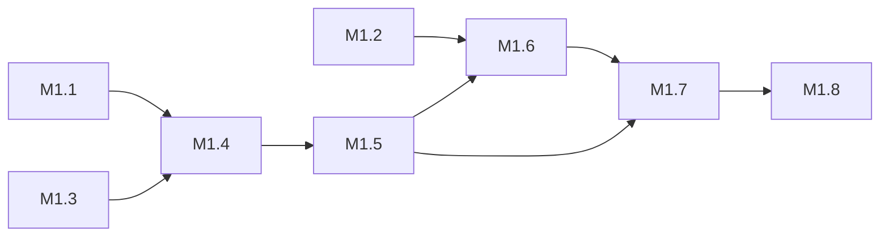
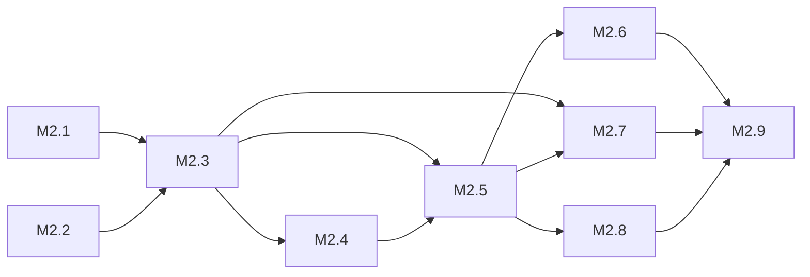
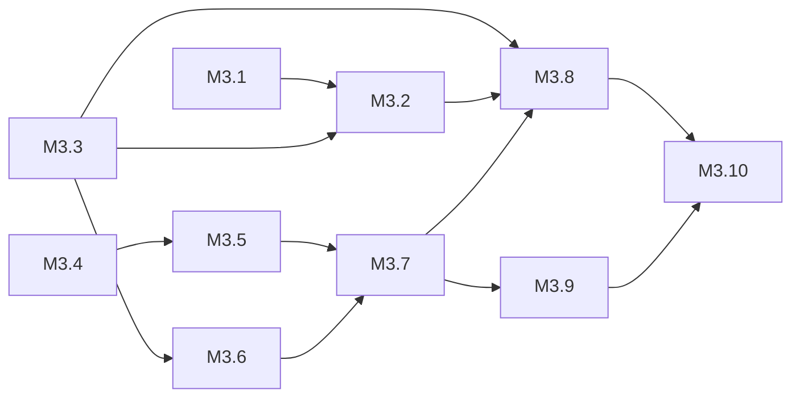
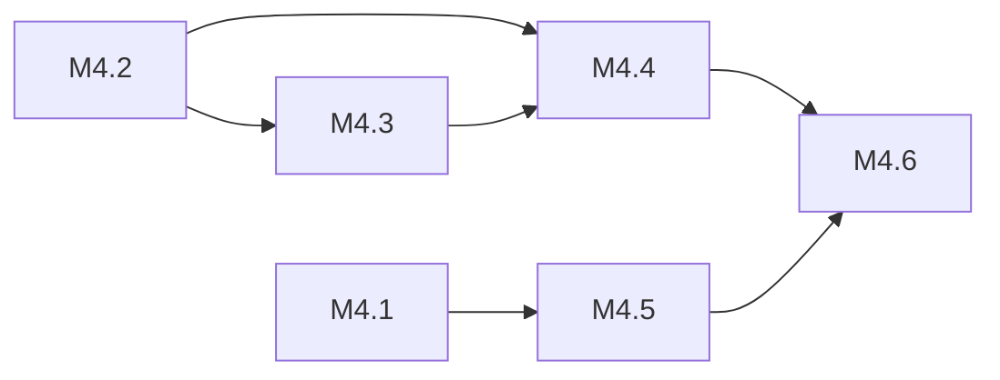

# StayOnBeat 开发计划

> 状态：v0.3（M1–M4 已实现并验证，M5 待推进）
> 依赖基线：`docs/product-design.md` v0.3、`docs/technical-solution.md` v0.3
> 更新规则：需求、架构或范围变化时，先更新产品和/或技术文档，再更新本计划。

## 1. 计划目标

把 StayOnBeat 从“文档基线”推进到“可部署的 MVP”，并保持交付过程可验证、可回滚、可持续迭代。本计划暂按单人/小团队推进，不预设专业测试团队。

## 2. 范围

### 2.1 本期交付范围

- 节拍器基础：BPM 1–240、拍号 1–12、重音、细分、计时器、Tap BPM。
- 双模式：节拍器模式、训练模式（默认）。
- 训练评分：键盘/鼠标点击、实时判定、连击、匹配度、会话总结。
- 视觉与交互：亮/暗主题、全屏、静音/仅视觉、响应式。
- 本地数据：设置持久化、历史训练记录。
- 质量：单元测试、关键 E2E、性能基线、静态部署。

### 2.2 明确不做（本期）

- 账号、登录、云同步、排行榜、社区。
- 乐谱解析、MIDI/乐器输入、复杂谱面编辑。
- PWA 离线安装、多语言、移动端触觉反馈。

## 3. 交付原则

1. **先跑通核心闭环**：节拍稳定 → 点击可判定 → 结果可保存。
2. **文档即基线**：实现偏差先修文档，再改代码。
3. **评分不可后补**：判定与调度是核心，不允许用视觉层掩盖计时误差。
4. **静音/视觉是等权场景**：不能假设用户一定有声音。
5. **小步可验证**：每个里程碑结束都应有可演示物和可运行测试。
6. **不复制参考站素材**：只参考交互，不搬 Logo、文案、图标、CSS。

## 4. 里程碑总览

| 里程碑 | 目标 | 主要产出 | 建议时间 |
| --- | --- | --- | --- |
| M0 | 基线冻结 | 文档、脚手架、工具链、AI 规范 | 1–2 天 |
| M1 | 节拍器核心 | BPM、拍号、重音、稳定调度、开始/停止 | 2–4 天 |
| M2 | 设置与体验 | 细分、计时器、Tap BPM、主题、全屏 | 3–5 天 |
| M3 | 训练评分 | 训练模式、输入、判定、实时 HUD | 4–7 天 |
| M4 | 总结与历史 | 总结页、历史记录、设置持久化 | 2–4 天 |
| M5 | 发布准备 | 响应式、可访问性、测试、性能、部署 | 3–5 天 |

总估算：约 3–5 周，视投入时间波动。M0–M2 是基础链路，必须优先完成；M3 是产品核心。

## 5. 任务拆解

### 5.1 M0：基线冻结（已完成）

- [x] 确认 React + TypeScript + Vite + Tailwind + Zustand 技术栈。
- [x] 初始化最小可运行工程，配置 ESLint、Prettier、TypeScript 严格模式。
- [x] 配置 Vitest 与 Testing Library。
- [x] 配置 Playwright 基础工程。
- [x] 建立目录边界：`engine/`、`store/`、`components/`、`lib/`、`test/`。
- [x] 锁定文档版本，更新 README 和 AGENTS。

**验收**

- 空页面可本地启动、可构建、可跑一个冒烟测试。
- 文档导航包含全部基线与开发计划。

### 5.2 M1：节拍器核心

> 详细任务拆解见 §5.2.1–5.2.4。模块接口以 `docs/technical-solution.md` §5.1/§6 为准（M1 细化裁决：lookahead 调度循环归 `MetronomeEngine`，`AudioEngine` 为纯发声层）。

- [ ] 实现 `AudioContext` 生命周期管理和用户手势解锁。
- [ ] 实现 lookahead scheduler，不用 `setInterval` 驱动发声。
- [ ] 实现 BPM 1–240、默认 120，+/- 与滑块调整。
- [ ] 实现每小节拍号 1–12、默认 4，节拍序号循环。
- [ ] 实现第一拍重音与非重音音色。
- [ ] 实现视觉拍点灯与当前拍高亮。
- [ ] 实现开始/停止按钮。

#### 5.2.1 任务拆解

| ID | 任务标题 | 说明 | 主要文件（新建/改） | 依赖 | 每任务验收 |
| --- | --- | --- | --- | --- | --- |
| M1.1 | ✅ 节拍常量与节奏计算 | `MIN/MAX/DEFAULT_BPM`、`MIN/MAX/DEFAULT_BEATS_PER_BAR`、`SubdivisionFactor`（M1 固定为 1）；`secondsPerBeat`、`secondsPerSubdivision`、`clampBpm`、`clampBeatsPerBar`、`tempoMarking`（120→Moderato）。 | `src/lib/tempo.ts`、`src/lib/tempo.test.ts` | — | 边界断言：`secondsPerBeat(120)=0.5`、`clampBpm(0)=1`、`clampBpm(241)=240`、`tempoMarking(120)=Moderato`。 |
| M1.2 | ✅ 音频↔性能时钟桥 | `createClockBridge()`/应用单例；`calibrate(ctx)` 记录 epoch；`audioToPerfMs`/`perfMsToAudio` 互为反函数；`getOutputTimestamp` 可选增强。 | `src/lib/clock.ts`、`src/lib/clock.test.ts` | — | 往返换算误差 < 1e-9；无 `getOutputTimestamp` 时走回退路径不抛错。 |
| M1.3 | ✅ AudioContext 生命周期与节拍发声 | `ensureContext()`（惰性创建、幂等、`closed` 重建）、`resume()`、`scheduleBeat(audioTime, { accent })`（accent 1760Hz/普通 880Hz，sine + 短包络，返回 `stop()` 句柄）、`setVolume(0..1)`、`dispose()`；注入 `createAudioContext` 便于测试。 | `src/engine/audioEngine.ts`、`src/engine/audioEngine.test.ts` | M1.1（弱） | 重音/普通频率正确；`ensureContext` 幂等、`dispose` 后重建；音量夹取 0–1。 |
| M1.4 | ✅ lookahead 调度与节拍序列 | 常量 `SCHEDULER_TICK_MS=25`、`SCHEDULE_AHEAD_S=0.12`、`START_LEAD_S=0.06`；`start()` 在点击调用栈内同步 `ensureContext()` + `await resume()`，再校准时钟桥；`tick()` while 预排 `nextNoteTime`；`stop()` 清 timer + flush pending + suspend；播放中改 BPM/拍号走 `restartRound()`（flush 已排节点 + 从第 1 拍重排）；`beatIndexAtAudioTime(audioNow)`。 | `src/engine/metronomeEngine.ts`、`src/engine/metronomeEngine.test.ts` | M1.1、M1.3 | 已排节拍均 < `currentTime + 0.12` 且相邻间距恒为 `secondsPerBeat`；accent 仅 index 0；`stop()` 撤销全部 pending；播放中改速后从第 1 拍重排。 |
| M1.5 | ✅ Zustand 节拍器状态与动作 | 状态 `bpm/beatsPerBar/accentFirstBeat/isPlaying/currentBeat`；动作 `start/stop/setBpm/setBeatsPerBar/setAccentFirstBeat/_setCurrentBeat`；导出工厂 `createMetronomeStore(deps)` 注入假引擎、`INITIAL_STATE`、`resetMetronomeStore()`。 | `src/store/useMetronomeStore.ts`、`src/store/useMetronomeStore.test.ts` | M1.3、M1.4 | 默认值 120/4/true/false/-1；`setBpm(999)=240`；`start/stop` 委托引擎并翻转 `isPlaying`。 |
| M1.6 | ✅ 视觉脉冲与主显示 | `useBeatPulse()`：rAF 每帧 `perfMsToAudio(performance.now())` → `beatIndexAtAudioTime` → 写 `currentBeat`，卸载/停止时 cancel；`MetronomeDisplay`：BPM 大数字（tabular-nums）+ 速度术语 + 拍点灯（当前拍高亮、第 0 拍重音放大）。 | `src/hooks/useBeatPulse.ts`、`src/components/MetronomeDisplay.tsx`、`src/components/MetronomeDisplay.test.tsx` | M1.2、M1.5 | 灯数 = `beatsPerBar`；`data-active`/`aria-current`；卸载后不写 state（无告警）。 |
| M1.7 | ✅ 控件与接线 | `TempoControls`（滑块 + `-`/`+`）、`BeatSettings`（拍号 1–12 + 重音开关）、`TransportControls`（开始/停止，点击即手势）；`App.tsx` 替换 M0 占位。 | `src/components/TempoControls.tsx`、`src/components/BeatSettings.tsx`、`src/components/TransportControls.tsx` 及各自测试、`src/App.tsx`、`src/App.test.tsx` | M1.5、M1.6 | 滑块/± 改 BPM 且边界禁用；开始/停止随 `isPlaying` 切换；页面可交互、点击「开始」后有声音且拍灯闪烁。 |
| M1.8 | ✅ 集成验收与 E2E | 补齐组件测试；新增 `tests/e2e/metronome.spec.ts`；展开本小节并勾选完成。 | `tests/e2e/metronome.spec.ts`、`docs/development-plan.md` | M1.7 | 测试/构建/lint 全绿；E2E 已编写待浏览器环境执行；本小节验收清单勾选。 |

#### 5.2.2 任务依赖图



#### 5.2.3 模块接口概览

签名简列，实现细节以任务为准：

```ts
// src/lib/tempo.ts
secondsPerBeat(bpm: number): number
secondsPerSubdivision(bpm: number, subdivision?: 1 | 2 | 3 | 4): number
clampBpm(value: number): number          // 取整 + 夹取 1–240
clampBeatsPerBar(value: number): number  // 整数 1–12
tempoMarking(bpm: number): { zh: string; en: string }

// src/lib/clock.ts
createClockBridge(): AudioClockBridge     // calibrate(ctx); audioToPerfMs(t); perfMsToAudio(t)
// 应用单例：audioClockBridge

// src/engine/audioEngine.ts
createAudioEngine(opts?): AudioEngine
// AudioEngine: ensureContext(); resume(); suspend();
//   scheduleBeat(audioTime, { accent }): { stop(): void }; setVolume(0..1); dispose()

// src/engine/metronomeEngine.ts
createMetronomeEngine(audioEngine): MetronomeEngine
// MetronomeEngine: start(); stop(); setBpm(); setBeatsPerBar(); setAccentFirstBeat();
//   isPlaying(); currentAudioTime(): number; beatIndexAtAudioTime(audioNow): number;
//   getConfig(); resumeAfterBackground(); dispose()

// src/store/useMetronomeStore.ts
createMetronomeStore(deps?): store       // 测试注入假引擎
useMetronomeStore                          // 应用单例（模块顶层创建引擎后导出）
INITIAL_STATE; resetMetronomeStore()

// src/hooks/useBeatPulse.ts
useBeatPulse(): void                      // rAF 循环驱动 currentBeat
```

#### 5.2.4 M1 集成验收

- [ ] 60–180 BPM 前台连续播放 5 分钟无断拍（需真实浏览器/音频环境人工验收；调度稳定性已由单测锁定）。
- [x] 播放中改 BPM/拍号后，下一轮从第 1 拍开始。（单测覆盖）
- [x] 首次发声必须由用户手势触发（Start 点击）。（ensureContext 在点击调用栈内同步执行；组件测试覆盖开始/停止切换）
- [x] 后台切回前台若断拍，`resumeAfterBackground()` 重校准时钟桥并从第 1 拍恢复。（单测覆盖）

执行命令：`pnpm test` / `pnpm test:e2e` / `pnpm build` / `pnpm lint`。E2E 因当前环境无 Playwright 浏览器且下载被网络策略阻断，未在本机执行（见 §11 风险）。

### 5.3 M2：设置与体验

> 详细任务拆解见 §5.3.1–5.3.4。模块接口以 `docs/technical-solution.md` §5.1/§6/§8/§10 为准（M2 关键裁决：`beatIndexAtAudioTime` 保持拍语义并新增 `subdivisionIndexAtAudioTime`；静音仍建 AudioContext 驱动时钟但 `scheduleBeat` 零节点；主题用 CSS 变量 + `data-theme`；设置用 zustand persist；计时器归引擎音频时钟）。

- [x] 实现细分：四分、八分、三连音、十六分。
- [x] 实现计时器：15s/30s/60s/120s 快捷与自定义，到点自动停止。
- [x] 实现 Tap BPM：至少 4 次点击估算 BPM，并同步到主控区。
- [x] 实现亮/暗主题，默认暗色。
- [x] 实现全屏视图。
- [x] 实现静音/仅视觉节拍，静音时视觉提示增强。
- [x] 实现用户设置本地持久化。

#### 5.3.1 任务拆解

| ID | 任务标题 | 说明 | 主要文件（新建/改） | 依赖 | 每任务验收 |
| --- | --- | --- | --- | --- | --- |
| M2.1 | ✅ 细分常量与标签 | `tempo.ts` 增 `SUBDIVISIONS: readonly SubdivisionFactor[] = [1,2,3,4]`、`subdivisionLabel(sub)`（1 四分/Quarter、2 八分/Eighth、3 三连音/Triplet、4 十六分/Sixteenth）；复用已有 `secondsPerSubdivision`。 | `src/lib/tempo.ts`、`src/lib/tempo.test.ts` | — | `subdivisionLabel(1).zh='四分'`；`subdivisionLabel(4).en='Sixteenth'`；`secondsPerSubdivision(120,3)≈0.1667`。 |
| M2.2 | ✅ 细分音色与静音无操作 | `audioEngine.scheduleBeat` 增 `soft` 选项（非拍头子拍 1320Hz、峰值音量 ×0.6）；`setMuted(muted)` 使 `scheduleBeat` 返回空句柄、不创建任何节点；`isMuted()`。 | `src/engine/audioEngine.ts`、`src/engine/audioEngine.test.ts` | M2.1 | 重音 1760Hz / 拍头 880Hz / soft 1320Hz×0.6；muted 后 `createOscillator` 不被调用、`scheduleBeat` 仍返回可调 `{stop}`。 |
| M2.3 | ✅ 细分调度与子拍相位 | `MetronomeConfig` 增 `subdivision`（默认 1）；`tick()` 按 `secondsPerSubdivision` 推进 `subIndex/beatIndex`，accent 仅小节首拍头、soft 标记非拍头；`setSubdivision()` 播放中 `restartRound()`；新增 `subdivisionIndexAtAudioTime()`；`beatIndexAtAudioTime()` 保持按拍返回。 | `src/engine/metronomeEngine.ts`、`src/engine/metronomeEngine.test.ts` | M2.1、M2.2 | subdivision=2 时相邻排拍间距=0.25s（120BPM）、accent 仅 index0、其余 soft=true；`beatIndexAtAudioTime` 与 M1 结果一致；`subdivisionIndexAtAudioTime` 在 0..sub-1。 |
| M2.4 | ✅ 计时器与自动停止 | config 增 `timerSeconds`（默认 60，`null`=无限）；start/`restartRound()` 计算 `endAudioTime`；tick 越界停排、清 interval、置 `playing=false`、触发 `setOnStopped()`；到点不 flush、不 suspend；`setTimerSeconds()` 播放中 `restartRound()`。 | `src/engine/metronomeEngine.ts`、`src/engine/metronomeEngine.test.ts` | M2.3 | 到点后不再 `scheduleBeat`、`isPlaying()=false`、回调触发；最后排拍未被 `stop()`；`suspend` 未被调用；`timerSeconds=null` 持续不停止。 |
| M2.5 | ✅ 设置状态与本地持久化 | store 新增 `subdivision/timerSeconds/muted/volume/theme/currentSubdivision` 及动作（委托引擎/audioEngine）；`createMetronomeStore(deps, opts?:{persist?,storage?})`，单例开 persist（key `stayonbeat-settings`，version 1，partialize 仅设置子集）；onRehydrate 同步主题到 DOM；`resetMetronomeStore` 兼容；test setup 加 `localStorage.clear()`。 | `src/store/useMetronomeStore.ts`、`src/store/useMetronomeStore.test.ts`、`src/test/setup.ts` | M2.3、M2.4 | 动作委托正确；persist 写/读（注入内存 storage）；partialize 不含瞬态字段；单例默认 `muted=true`、`volume=0.5`、`theme='dark'`。 |
| M2.6 | ✅ 主题、顶栏、全屏与设置抽屉 | `index.css` 用 CSS 变量 + `data-theme`（`:root` 默认暗色）；迁移现有组件硬编码色到 `var(--*)`；`useFullscreen`；`TopBar`（主题/全屏/静音/设置入口）；`SettingsDrawer`（音量滑块 + 静音 + 主题）；`setTheme` 同步 `documentElement.dataset.theme`。 | `src/index.css`、`src/App.tsx`、`src/components/TopBar.tsx`、`src/components/SettingsDrawer.tsx`、`src/hooks/useFullscreen.ts` 及测试、各组件色值迁移 | M2.5 | 切换主题后 DOM 属性变化且持久化；全屏 toggle/不支持时禁用；音量夹取 0–1；刷新无闪白。 |
| M2.7 | ✅ 静音视觉增强与子拍视觉 | `useBeatPulse` 同时写 `_setCurrentSubdivision`（读 `engine.subdivisionIndexAtAudioTime`）；`MetronomeDisplay` 活跃拍灯按子拍脉动（inline `animation-duration=secondsPerSubdivision*1000ms`）、加 `data-current-sub`/`data-muted`、静音徽标「仅视觉」；App 静音时屏幕边缘呼吸光（`aria-hidden`）；`prefers-reduced-motion` 关动画。 | `src/hooks/useBeatPulse.ts`、`src/components/MetronomeDisplay.tsx`、`src/App.tsx`、`src/index.css` | M2.5、M2.3 | 静音下 `data-muted=true` 且 `data-current-sub` 随子拍变化；呼吸光随 muted 出现/消失；动画时长与子拍一致；reduced-motion 无动画。 |
| M2.8 | ✅ Tap BPM | `src/lib/tapTempo.ts` `estimateTapTempo(times, minTaps=4)`（中位数 + 过滤 200–3000ms + `clampBpm`）；`useTapTempo`（`taps/estimatedBpm/onTap/reset`，gap>2500ms 重置）；`TapTempo` 组件（点击计数、≥4 显示估算、应用→`store.setBpm`、重置）。 | `src/lib/tapTempo.ts`、`src/lib/tapTempo.test.ts`、`src/hooks/useTapTempo.ts`、`src/components/TapTempo.tsx` | M2.5 | ≥4 次估算并 clamp；抖动样本取中位数；<4 返回 null；gap 超时重置；应用后 `store.bpm` 更新。 |
| M2.9 | ✅ PatternSettings/计时器 UI 与集成、E2E、文档 | `PatternSettings`（拍号/重音/细分/计时器 15/30/60/120/自定义 1–3600/无限）取代 `BeatSettings`（保留 `每小节拍数` aria-label）；App 接线 TopBar/Display/Transport/Tempo/PatternSettings/TapTempo/SettingsDrawer；E2E 补充；展开本节并同步 technical-solution/ai-agent-guide；勾选完成。 | `src/components/PatternSettings.tsx`(+test)、`src/App.tsx`、`tests/e2e/*`、`docs/*.md` | M2.5–M2.8 | 细分/计时器控件联动 store 与引擎；E2E：细分切换、2s 计时到点停止、主题刷新持久化、Tap BPM、静音徽标；测试/构建/lint 全绿；文档勾选。 |

#### 5.3.2 任务依赖图



#### 5.3.3 模块接口概览

签名简列，实现细节以任务为准：

```ts
// src/lib/tempo.ts（新增）
SUBDIVISIONS: readonly SubdivisionFactor[]          // [1, 2, 3, 4]
subdivisionLabel(sub: SubdivisionFactor): { zh: string; en: string }
// secondsPerSubdivision(bpm, subdivision) 已在 M1 提供

// src/engine/audioEngine.ts（扩展）
export const SUB_FREQ = 1320
export const SUB_GAIN_RATIO = 0.6
export interface BeatSoundOptions { accent: boolean; soft?: boolean }
// AudioEngine 增: setMuted(muted: boolean); isMuted(): boolean
// muted=true 时 scheduleBeat 返回 { stop() {} }，不创建 osc/gain；start() 仍由引擎 ensureContext+resume

// src/engine/metronomeEngine.ts（扩展）
export interface MetronomeConfig {
  bpm: number; beatsPerBar: number; accentFirstBeat: boolean
  subdivision: SubdivisionFactor      // 默认 1
  timerSeconds: number | null         // 默认 60；null = 无限
}
// MetronomeEngine 增: setSubdivision(sub); setTimerSeconds(sec);
//   subdivisionIndexAtAudioTime(audioNow): number   // 0..subdivision-1；未播放返回 -1
//   setOnStopped(cb: () => void)                    // 仅计时器到点自动停止时触发
// tick() 按 secondsPerSubdivision 推进；排拍上界 min(currentTime+0.12, endAudioTime)
// beatIndexAtAudioTime 保持拍语义（0..beatsPerBar-1）

// src/store/useMetronomeStore.ts（扩展）
createMetronomeStore(deps?, opts?: { persist?: boolean; storage?: StateStorage })
// 状态新增: subdivision; timerSeconds; muted(默认 true); volume(默认 0.5);
//   theme('dark'|'light', 默认 'dark'); currentSubdivision(-1)
// 动作新增: setSubdivision; setTimerSeconds; setMuted; setVolume; setTheme; _setCurrentSubdivision
// persist: name='stayonbeat-settings', version=1, partialize 仅 bpm/beatsPerBar/accentFirstBeat/
//   subdivision/timerSeconds/muted/volume/theme

// src/lib/tapTempo.ts（新建）
estimateTapTempo(tapTimesMs: readonly number[], minTaps = 4): number | null

// src/hooks/useTapTempo.ts（新建）
useTapTempo(opts?): { taps; estimatedBpm; onTap(); reset() }

// src/hooks/useFullscreen.ts（新建）
useFullscreen(): { isFullscreen; toggle(); supported }

// src/index.css（主题机制）
// :root, :root[data-theme='dark'] 与 :root[data-theme='light'] 定义 --bg/--panel/--text-primary/
// --text-secondary/--border/--primary/--primary-soft/--danger；组件用 bg-[var(--bg)] 等
// @media (prefers-reduced-motion: reduce) { .beat-pulse, .screen-glow { animation: none } }
```

#### 5.3.4 M2 集成验收

- [x] 细分 × 拍号组合下重音与节拍密度符合产品定义（单测：间距=`secondsPerSubdivision`、accent 仅小节首拍头）。
- [x] 计时器到点自动停止、无残留音频（单测：停止排拍、不 suspend、回调触发；E2E 已编写待浏览器环境）。
- [x] 刷新后 BPM/拍号/细分/计时器/主题/静音/音量恢复（persist 单测覆盖；E2E reload 已编写待执行）。
- [x] 静音模式视觉脉冲完整支持训练（`data-muted` + 子拍脉动 + 边缘呼吸光；`prefers-reduced-motion` 关动画）。
- [x] Tap BPM ≥4 次估算并同步主控。
- [x] 亮/暗主题默认暗色、切换持久化、刷新无闪白。

执行命令与 §5.2.4 相同（本机用 `node_modules/.bin/*` 运行 vitest/eslint/tsc/vite/playwright）。

### 5.4 M3：训练评分

> 详细任务拆解见 §5.4.1–5.4.4。模块接口以 `docs/technical-solution.md` §5.1/§6.3/§7/§8/§9 为准（M3 关键裁决：`mode/countInEnabled` 持久化于 metronome store，训练运行时独立 `useTrainingStore`；输入抽 `src/lib/input.ts` 纯函数 + `useTrainingInput` hook；Miss 过期由 50ms tick 驱动；`addOnStopped` 多回调收计时器到点；后台中止为 aborted；预期拍时间确定性计算）。

- [x] 实现“节拍器 / 训练”模式切换，默认训练。
- [x] 实现 count-in：默认 1 小节，可选关闭，不计入评分。
- [x] 实现键盘输入：`Space`/`Enter`，阻止 `event.repeat`。
- [x] 实现鼠标/触摸输入：`pointerdown`，统一输入源并去重。
- [x] 实现时钟桥：音频时间、性能时间、输入事件时间对齐。
- [x] 实现动态判定窗口与命中判定。
- [x] 实现 Perfect/Great/Good/Miss 动画反馈。
- [x] 实现实时匹配度、连击、早期/晚期偏差。
- [x] 实现训练中锁定 BPM/拍号/细分/计时器，修改下一轮生效。

#### 5.4.1 任务拆解

| ID | 任务标题 | 说明 | 主要文件（新建/改） | 依赖 | 每任务验收 |
| --- | --- | --- | --- | --- | --- |
| M3.1 | ✅ 模式切换与训练状态字段 | `useMetronomeStore` 增 `mode:'training'\|'metronome'`（默认 training）、`countInEnabled:boolean`（默认 true）+ `setMode/setCountInEnabled`，入 persist partialize；`TopBar` 增「节拍器/训练」切换。 | `src/store/useMetronomeStore.ts` + test、`src/components/TopBar.tsx` + test | — | 默认 training；切换持久化；组件测试切换调用 `setMode`。 |
| M3.2 | ✅ 训练运行时 store | 新建 `useTrainingStore`（非持久化，单例 + 工厂）：`phase:idle/ready/countIn/training/summary`、session 运行时（hits/judgements/combo/maxCombo/totalScore/resolvedCount/lastJudgement/lastOffsetMs/earlyCount/lateCount）、动作 `startSession/recordHit/expireMissedBeats/endSession`、50ms Miss 过期 tick。 | `src/store/useTrainingStore.ts` + test | M3.1 | 状态机流转；hit 记录；Miss 过期；endSession 结算。 |
| M3.3 | ✅ metronomeEngine 评分支撑 | 增 `getFirstBeatTime(): number\|null`、`addOnStopped(cb)`（多回调，与 `setOnStopped` 并存）。 | `src/engine/metronomeEngine.ts` + test | — | `firstBeatTime` 正确；计时器到点触发全部回调。 |
| M3.4 | ✅ 输入纯函数 | 新建 `src/lib/input.ts`：`normalizeEventTimeMs(ts)`（performance-relative vs epoch 判别换算）、`shouldDedupe(prevMs, nowMs, windowMs=50)`。 | `src/lib/input.ts` + test | — | 时间基换算正确；50ms 去重窗口。 |
| M3.5 | ✅ 输入采集 hook 与 TrainingPad | `useTrainingInput({onHit, enabled, padRef})`：keydown（Space/Enter `preventDefault`、过滤 `event.repeat`）+ pointerdown（限定 `data-training-pad`）+ 50ms 去重 → `onHit(perfMs)`；`TrainingPad` 大点击区 + 键盘提示 + 命中/漏拍反馈。 | `src/hooks/useTrainingInput.ts`、`src/components/TrainingPad.tsx` + test | M3.4 | keydown/pointerdown 触发 onHit；repeat 过滤；pad 外不触发；去重。 |
| M3.6 | ✅ 判定纯函数 | 新建 `src/lib/scoring.ts`：`computeJudgementWindows(intervalMs)`（min(120,interval*0.25) 等）、`judgeOffset(offsetMs, windows)`、`judgementScore(j)`、`computeAccuracy(totalScore, expectedCount)`、`nearestExpectedGlobalIndex(inputAudio, firstScoringTime, spSub, goodWindow, nextIndex)`。 | `src/lib/scoring.ts` + test | M3.3 | 固定偏差命中对应区间；窗口随高 BPM/细分收紧；Miss 超窗。 |
| M3.7 | ✅ 命中记录与实时统计 | `recordHit(perfMs)`：经 `audioClockBridge.perfMsToAudio` 映射到音频 → 找最近未消费预期拍 → 判 offset → 更新 combo/分数/计数；`liveAccuracy` 用 `resolvedCount` 防 >100%。 | `src/store/useTrainingStore.ts` + test | M3.5、M3.6 | 一预期拍一有效点击；冗余不计分；count-in 前不记分；实时匹配度正确。 |
| M3.8 | ✅ 训练流程与 count-in | `startTraining()`：count-in 1 小节（可关）→ 50ms tick 判 `audioNow >= firstScoringTime` 进 training；计时器到点（`addOnStopped`）→ completed、手动停止 → aborted、后台 hidden → aborted；结束结算 session result（对齐 §8.2）。 | `src/store/useTrainingStore.ts` + test | M3.2、M3.3、M3.7 | count-in 点击不记分；到点 completed；手动/后台 aborted；结算字段正确。 |
| M3.9 | ✅ 实时 HUD 与判定动画 | `ScoreHUD`（匹配度 1 位小数/连击/当前判定/早晚偏差）、`JudgementOverlay`（判定浮层 + 颜色 token）、App 训练模式布局（TrainingPad + HUD）。 | `src/components/ScoreHUD.tsx`、`JudgementOverlay.tsx`、`src/App.tsx` + test | M3.7 | HUD 数值渲染；判定浮层；模式布局切换。 |
| M3.10 | ✅ 训练中锁定设置 + 集成/E2E/文档 | `phase==='training'` 时 Tempo/Pattern/Transport 相关 `disabled`；E2E 训练流程（count-in→输入→结束）、锁定设置；展开本节并勾选。 | `src/components/TempoControls.tsx`、`PatternSettings.tsx`、`tests/e2e/*`、`docs/*` | M3.8、M3.9 | 锁定组件 disabled；E2E 已编写；测试/构建/lint 全绿；文档勾选。 |

#### 5.4.2 任务依赖图



#### 5.4.3 模块接口概览

签名简列，实现细节以任务为准：

```ts
// src/engine/metronomeEngine.ts（新增）
getFirstBeatTime(): number | null                    // 会话首拍音频时间（评分基准）
addOnStopped(cb: () => void): void                   // 计时器到点多回调（与 setOnStopped 并存）

// src/lib/input.ts（新建）
normalizeEventTimeMs(ts: number): number             // 判别 performance-relative vs epoch 并换算
shouldDedupe(prevMs: number | null, nowMs: number, windowMs?: number): boolean

// src/lib/scoring.ts（新建）
computeJudgementWindows(intervalMs: number): { perfect: number; great: number; good: number }
judgeOffset(offsetMs: number, w: JudgementWindows): 'perfect' | 'great' | 'good' | 'miss'
judgementScore(j: Judgement): number                 // 100 / 85 / 65 / 0
computeAccuracy(totalScore: number, expectedCount: number): number
nearestExpectedGlobalIndex(inputAudio, firstScoringTime, spSub, goodWindow, nextIndex): number | null

// src/store/useTrainingStore.ts（新建）
phase: 'idle' | 'ready' | 'countIn' | 'training' | 'summary'
session: { hits: Array<{expectedBeatIndex:number; offsetMs:number|null; judgement:string}>;
  judgements: Record<Judgement, number>; combo: number; maxCombo: number;
  totalScore: number; resolvedCount: number; earlyCount: number; lateCount: number }
startSession(cfg): void; recordHit(perfMs: number): void;
expireMissedBeats(audioNow: number): void; endSession(status: 'completed'|'aborted'): SessionResult

// src/hooks/useTrainingInput.ts（新建）
useTrainingInput(opts: { onHit: (perfMs: number) => void; enabled: boolean;
  padRef: RefObject<HTMLElement | null> }): void

// src/store/useMetronomeStore.ts（新增字段，入 persist）
mode: 'training' | 'metronome'; countInEnabled: boolean
```

#### 5.4.4 M3 集成验收

- [x] 固定偏差输入命中对应判定区间（scoring 纯函数单测）。
- [x] 键盘重复与多输入源不重复计分（去重单测）。
- [x] count-in 阶段点击不影响成绩。
- [x] 静音与有声训练均可完成并计分（`muted` 不影响评分）。
- [x] 调度/判定相关纯函数有单测。
- [x] 训练中设置锁定；计时器到点 `completed`、手动/后台 `aborted`；session result 字段对齐技术方案 §8.2。

执行命令与 §5.2.4 相同（本机用 `node_modules/.bin/*` 运行 vitest/eslint/tsc/vite/playwright）。

### 5.5 M4：总结与历史

> 详细任务拆解见 §5.5.1–5.5.4。模块接口以 `docs/technical-solution.md` §5.1/§8.2/§9/§10 为准（M4 关键裁决：历史用原生 IndexedDB 薄适配 + 可注入存储，不新增依赖；保存时机在 summary 侧 `useSaveSessionToHistory`；记录补 `id/startedAt/endedAt`；再来一次 = `reset()+startTraining()`）。

- [x] 实现会话总结：匹配度、评级、判定分布、连击、平均偏差、早/晚率。
- [x] 实现会话状态 `completed / aborted`。
- [x] 实现历史记录列表与基础统计。
- [x] 使用 IndexedDB 保存训练记录，设置继续使用 localStorage。
- [x] 实现“再来一次”复用当前设置。

#### 5.5.1 任务拆解

| ID | 任务标题 | 说明 | 主要文件（新建/改） | 依赖 | 每任务验收 |
| --- | --- | --- | --- | --- | --- |
| M4.1 | 会话总结组件 | `SessionSummary`：匹配度大数字+评级、completed/aborted 徽标、判定分布（Perfect/Great/Good/Miss）、最大连击、平均偏移/标准差、早晚率、时长/BPM/拍号/细分。 | `src/components/SessionSummary.tsx` + test | M3 result | 渲染 `SessionResult` 全部关键字段；completed/aborted 徽标正确。 |
| M4.2 | ✅ 历史持久化 | `src/lib/history.ts`：`HistoryRecord = SessionResult & { id, startedAt, endedAt }`；`HistoryStorage` 接口（`add/getAll/clear`）；`createIndexedDbHistoryStorage`（原生 IDB，db `stayonbeat`/store `sessions`）；`createMemoryHistoryStorage`；`createHistoryStore(storage?)` 单例 `save/list/clear`。 | `src/lib/history.ts` + test | — | memory storage 单测覆盖 save/list/clear；IndexedDB 绑定薄。 |
| M4.3 | 训练结束保存 | 训练 store 记录 `startedAt`（start 时 wall-clock）与 `endedAt`（endSession）；`useSaveSessionToHistory` 在 `phase==='summary'` 且 result 变化时补 `id` 并 `save` 一次（按引用去重）。 | `src/store/useTrainingStore.ts`、`src/hooks/useSaveSessionToHistory.ts` + test | M4.2 | summary 时保存一次；重复渲染不重复保存；记录含 id/时间戳。 |
| M4.4 | ✅ 历史面板 | `HistoryPanel`：列表（时间/BPM/拍号/细分/匹配度/评级/状态）+ 基础统计（总次数/平均匹配度/最高/Best 评级）；on mount `list()`。 | `src/components/HistoryPanel.tsx` + test | M4.2、M4.3 | 空态与有数据渲染；统计正确。 |
| M4.5 | 再来一次/返回 | `SessionSummary` 增「再来一次」= `reset()+startTraining()`（复用当前设置）、「返回」= `reset()` 回 idle/ready。 | `src/components/SessionSummary.tsx` + test | M4.1、M4.3 | 再来一次开启新会话（phase 重新流转）；返回回 idle。 |
| M4.6 | ✅ 集成/E2E/文档 | App 训练模式 `phase==='summary'` → 显示 `SessionSummary`；历史入口；E2E 训练→总结→刷新历史仍在；展开本节并勾选。 | `src/App.tsx`、`tests/e2e/*`、`docs/*` | M4.4、M4.5 | 训练结束显示总结；刷新后历史仍在；测试/构建/lint 全绿；文档勾选。 |

#### 5.5.2 任务依赖图



#### 5.5.3 模块接口概览

签名简列，实现细节以任务为准：

```ts
// src/lib/history.ts（新建）
export interface HistoryRecord extends SessionResult {
  id: string
  startedAt: number
  endedAt: number
}
export interface HistoryStorage {
  add(record: HistoryRecord): Promise<void>
  getAll(): Promise<HistoryRecord[]>
  clear(): Promise<void>
}
export function createIndexedDbHistoryStorage(): HistoryStorage   // 原生 IDB，db 'stayonbeat' / store 'sessions'
export function createMemoryHistoryStorage(): HistoryStorage       // 测试用
export function createHistoryStore(storage?: HistoryStorage)      // save/list/clear
// 单例 historyStore

// src/hooks/useSaveSessionToHistory.ts（新建）
useSaveSessionToHistory(): void   // phase==='summary' 且 result 变化时保存一次

// src/store/useTrainingStore.ts（扩展）
// startTraining 记录 startedAt；endSession 记录 endedAt
```

#### 5.5.4 M4 集成验收

- [x] 正常结束（`completed`）与中途停止（`aborted`）都有正确总结（状态徽标 + 匹配度/评级/判定分布/连击/早晚率）。
- [x] 刷新后历史记录仍存在（IndexedDB 持久化；memory storage 单测覆盖 save/list/clear）。
- [x] 记录数据模型与技术方案 §8.2 一致（含 `id/startedAt/endedAt`）。
- [x] 再来一次复用当前设置开启新会话。

执行命令与 §5.2.4 相同（本机用 `node_modules/.bin/*` 运行 vitest/eslint/tsc/vite/playwright）。

### 5.6 M5：发布准备

- [ ] 桌面端与移动端响应式适配。
- [ ] 键盘全流程可操作、焦点可见、`prefers-reduced-motion` 支持。
- [ ] 补齐核心 E2E 流程。
- [ ] 性能检查：首次可交互、调度抖动、长时运行。
- [ ] 构建优化与静态部署到 Vercel 或 Cloudflare Pages。
- [ ] 配置 CI：类型检查、Lint、单元测试、E2E、构建。

**验收**

- Chrome/Edge/Firefox/Safari 最近两个大版本可用。
- 桌面端首次可交互约 1.5s 内，移动端约 3s 内。
- 常规前台使用下调度抖动目标 `p95 < 10ms`。
- 部署链接可完成一次完整训练并保存记录。

## 6. 依赖关系

```text
M0 工程基线
   ↓
M1 节拍器核心 ← M2 设置与体验
   ↓
M3 训练评分
   ↓
M4 总结与历史
   ↓
M5 发布准备
```

关键依赖：

- M3 依赖 M1 的稳定节拍序列和时钟基准。
- M4 依赖 M3 的会话结果数据。
- M5 不改变核心算法，只做验证、适配与发布；若 M5 暴露算法问题，回退到对应里程碑修复。

## 7. 质量门禁

每个里程碑合入前必须满足：

- 相关单元测试通过。
- 相关 E2E 或手动验收通过。
- 无 TypeScript 类型错误与 Lint 阻断项。
- 核心逻辑有对应文档说明；如算法变化，文档已同步。
- 不新增未批准的依赖或后端能力。

### 7.1 Definition of Done

- 功能符合产品设计。
- 实现符合技术方案。
- 边界情况有测试或明确记录。
- 用户设置和历史数据可持久化。
- 静音、有声、暗色、亮色、桌面、移动场景均经过至少一次验证。
- 本开发计划的对应任务勾选完成。

## 8. 测试计划

| 层级 | 工具 | 覆盖重点 |
| --- | --- | --- |
| 单元 | Vitest | 时钟桥、节拍序列、动态判定窗口、匹配度、冗余点击 |
| 组件 | Testing Library | 控件状态、TrainingPad、判定 HUD、Summary |
| 集成 | Vitest + mock AudioContext | 调度器生成节拍序列、计时器停止 |
| E2E | Playwright | 完整训练流程、设置持久化、历史记录 |
| 性能 | 浏览器 DevTools/脚本 | 调度抖动、长时运行、后台恢复 |

M1 阶段测试重点：tempo 计算边界、时钟桥换算、lookahead 节拍序列生成、transport 状态机、audioEngine 发声参数；使用 `src/test/fakeAudioContext.ts` 提供确定性 mock（`vi.fn()` 组合假 `AudioContext`，配合 `vi.useFakeTimers()` 手动推进 `currentTime`）。

M2 阶段测试重点：细分间距与 soft 音色、`subdivisionIndexAtAudioTime`、计时器自动停止（到点不 flush/suspend、回调触发）、静音下 `scheduleBeat` 零节点但调度继续、`useTapTempo` 中位数估算、主题 `data-theme` 切换与持久化、`useFullscreen` 降级；E2E 补细分/计时器/持久化/Tap/静音徽标。

M3 阶段测试重点：判定窗口动态收紧与偏移→判定、`nearestExpectedGlobalIndex`、一预期拍一有效点击与冗余去重、Miss 过期（50ms tick）、count-in 不记分、`liveAccuracy` 用 `resolvedCount`、输入时间基换算与去重窗口、训练状态机（count-in→training→summary）与三类中止（timer/manual/background）；E2E 补训练全流程与锁定设置。

M4 阶段测试重点：history store（memory storage）save/list/clear、`HistoryRecord` 补 `id/startedAt/endedAt`、`useSaveSessionToHistory` 只保存一次（按引用去重）、`SessionSummary`/`HistoryPanel` 渲染与统计、再来一次复用设置；E2E 补训练→总结→刷新历史仍在。

测试数据建议：

- BPM：30、60、120、180、240。
- 拍号：1、3、4、7。
- 细分：1、2、3、4。
- 判定：构造 -100ms、-40ms、-10ms、+35ms、+85ms、+130ms 等点击偏差。

## 9. 开发流程

### 9.1 分支与提交

- 主分支保持可运行。
- 每个里程碑或独立任务使用短生命周期分支。
- 提交信息说明“做了什么、为什么”，不堆积无关改动。

### 9.2 AI 协作流程

- 开始前阅读 `AGENTS.md`、`docs/ai-agent-guide.md` 和本计划。
- 先识别任务属于哪个里程碑，确认依赖是否已满足。
- 需求或算法变化时，先更新产品/技术文档。
- 完成一个任务后，在最终回复中说明文件、测试和验收状态。

### 9.3 评审顺序

1. 产品范围是否符合 MVP。
2. 是否破坏核心计时/评分。
3. 是否增加不必要复杂度。
4. 是否影响静音模式、移动端或可访问性。
5. 是否有文档未同步的临时实现。

## 10. 部署与发布

- 使用静态托管：Vercel 或 Cloudflare Pages。
- 每次合并到主分支自动构建，必要时生成预览链接。
- 正式发布前跑完整 E2E。
- 发布后记录版本、日期、关键变更。

### 10.1 发布检查清单

- [ ] 产品/技术/开发计划文档版本一致。
- [ ] 构建产物通过 CI。
- [ ] 核心用户流程在目标浏览器可运行。
- [ ] 无敏感信息、本机路径、无关文件进入仓库。
- [ ] 历史数据模型兼容或迁移策略明确。

## 11. 风险与应对

| 风险 | 影响 | 应对 |
| --- | --- | --- |
| 浏览器音频调度差异 | 判定不公平 | 使用 Web Audio 时钟桥，必要时提供校准，按相对稳定偏差展示 |
| 后台标签页定时器节流 | 节拍中断 | 音频调度不依赖主线程定时器，回到前台重校准 |
| 键盘重复/多输入源重复计分 | 分数虚高 | 输入统一去重，`event.repeat` 过滤 |
| 静音模式下视觉提示不足 | 核心场景不可用 | 视觉脉冲做独立验收，不依赖颜色 |
| 无线键盘/蓝牙耳机延迟 | 用户体感偏差大 | 文案提示低延迟路径，后续提供手动校准 |
| 过早追求复杂谱面/账号体系 | MVP 延迟 | 本期明确不做，P1/P2 另排 |
| 参考站素材侵权风险 | 合规问题 | 仅参考交互，不复用任何受保护素材 |

## 12. 进度管理

- 以里程碑为检查点，不以“开发中”代替完成。
- M1 起按 §5.2.1 任务表逐条推进，每条完成即勾选并跑相关测试。
- 每周或每轮集中更新一次任务状态、风险和下一里程碑目标。
- 每完成一个里程碑，更新本文件的任务勾选状态并记录实际耗时。
- 若出现连续阻塞，回到 `AGENTS.md` 或产品/技术文档确认决策。

## 13. 成功指标

MVP 发布后观察：

- 首次训练完成率。
- 平均训练时长。
- 7 日回访率。
- 静音模式使用率。
- Tap BPM 使用率。
- 不同 BPM 下的匹配度分布，用于校准判定窗口。

## 14. 下一步行动

1. M0 与 M1 已完成：工程与工具链就绪，节拍器核心（BPM/拍号/重音、lookahead 调度、开始/停止、视觉拍灯、后台恢复）落地，§5.2.1 任务表 M1.1–M1.8 全部勾选。
2. 剩余验收：在真实浏览器完成 5 分钟连续播放与 E2E（本机缺 Playwright 浏览器）。
3. M2 设置与体验已完成（细分、计时器、Tap BPM、亮暗主题、全屏、静音/仅视觉、设置持久化），§5.3.1 任务表 M2.1–M2.9 全部勾选。
4. M3 训练评分已完成（双模式切换、count-in、键盘/鼠标输入、动态判定窗口、实时匹配度/连击、训练中锁定），§5.4.1 任务表 M3.1–M3.10 全部勾选。
5. M4 总结与历史已完成（会话总结、IndexedDB 历史、completed/aborted、再来一次），§5.5.1 任务表 M4.1–M4.6 全部勾选。
6. 下一里程碑 M5 发布准备：响应式、可访问性、性能、CI、静态部署。
4. 根据 M1 实测调度抖动，评估是否提前引入校准能力。
