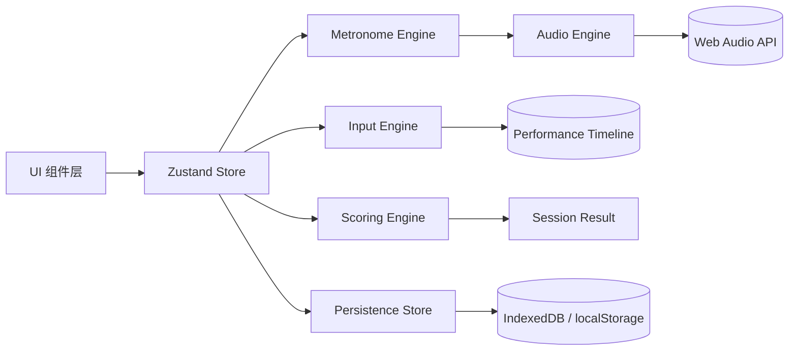

# StayOnBeat 技术方案

> 状态：v0.3（M1–M5 已实现，MVP 待部署上线）
> 参考站点：https://metronome-online.com/zh
> 产品定位：面向无法在工作时间练琴的用户的“在线节奏训练器”，在节拍器基础上增加键盘/鼠标点击匹配与即时评分。

## 1. 文档目的

本文件定义 StayOnBeat 的工程实现方案，作为后续编码、评审和 AI 协作的技术基线。实现阶段应优先遵守本文件；如发现本文件与真实约束冲突，先更新本文件再编码。

## 2. 目标与非目标

### 2.1 MVP 目标

- 浏览器直接运行，无需安装、无需登录。
- 提供稳定节拍器：BPM、每小节拍数、重音、细分、计时器、Tap BPM、声音开关。
- 提供“节奏训练模式”：跟随节拍用键盘或鼠标点击，实时给出命中判定、连击和匹配度。
- 支持静音/仅视觉节拍，适配办公室低打扰场景。
- 桌面端优先，移动端可用。
- 本地保存设置和最近训练记录，无后端也能完整工作。

### 2.2 非目标（MVP）

- 不做账号体系、社区、排行榜、云同步。
- 不解析真实乐谱，不生成复杂音游谱面。
- 不做 MIDI/乐器输入识别。
- 不复制参考站点的品牌、文案、Logo、图标和专属素材。

## 3. 参考站点能力盘点

从 `metronome-online.com/zh` 提取的核心功能：

- BPM 数值显示，范围 1–240，支持滑块与 +/- 按钮，并显示速度术语（Largo/Adagio/Andante/Moderato/Allegro/Presto）。
- 每小节节拍数：1–12，默认 4。
- “压力第一拍”重音开关。
- 计时器：分钟/秒，到点自动停止。
- 细分：四分、八分、三连音、十六分及常见节奏型。
- Tap BPM：手动点击估算速度。
- 开始/停止按钮。
- 亮/暗模式、全屏模式。
- 声音风格选择（MVP 仅提供声音开关与音量，不实现多音色）。
- 440Hz 校音音（MVP 不实现，列为后续可选项）。
- 大量 BPM 快捷入口与说明内容。

StayOnBeat 需要保留上述基础体验，并把“点击 BPM / 节拍器”升级为“训练模式 + 实时评分”。

## 4. 技术选型

| 领域 | 建议方案 | 理由 | 备选 |
| --- | --- | --- | --- |
| 前端框架 | React 18 + TypeScript | 组件化适合交互面板，生态成熟 | Vue 3 |
| 构建工具 | Vite | 启动快、配置少 | Next.js |
| 样式 | Tailwind CSS | 快速实现参考站风格与响应式 | CSS Modules |
| 状态管理 | Zustand | 轻量、适合音频/会话状态 | Redux Toolkit |
| 路由 | MVP 单页，暂不引入 React Router | 减少复杂度 | 后续按需 |
| 音频 | Web Audio API | 高精度调度，是准确计分的基础 | Howler.js |
| 动画 | CSS + requestAnimationFrame | 节拍脉冲、判定动画 | Framer Motion |
| 本地存储 | localStorage（设置）+ IndexedDB（历史） | 支持结构化会话数据 | Dexie |
| 测试 | Vitest + Testing Library + Playwright | 单元、组件、E2E 分层 | Jest + Cypress |
| 部署 | 静态托管：Vercel / Cloudflare Pages | 零后端、免费额度、全球加速 | GitHub Pages |

### 4.1 为什么不选后端优先

MVP 所有核心逻辑都在客户端。历史记录属于个人轻量数据，使用 IndexedDB 足够。后端仅在后续加入排行榜、账号、跨设备同步时引入。

## 5. 总体架构



### 5.1 模块职责

- `MetronomeEngine`：拥有 lookahead 调度循环（约 25ms refill timer + while 预排），管理 BPM、拍号、细分、计时器、启动/停止，维护 `nextNoteTime`/`beatIndex`/`firstBeatTime`/预期节拍时间序列，并暴露 `beatIndexAtAudioTime()` 供视觉层读取；M3 增 `getFirstBeatTime()`/`addOnStopped()` 供评分层使用。
- `AudioEngine`：纯发声层。封装 `AudioContext` 生命周期（惰性创建、用户手势解锁、`closed` 重建）、`scheduleBeat(audioTime, { accent, soft })` 在音频时间线上排振荡器、重音/拍头/子拍音色、音量、静音；不感知拍号/速度。
- `InputEngine`：M3 落地为 `src/lib/input.ts`（纯函数：事件时间基换算、去重窗口）+ `useTrainingInput`（hook：键盘/鼠标监听、过滤 `event.repeat`、`pointerdown` 限定训练垫）。
- `ScoringEngine`：M3 落地为 `src/lib/scoring.ts`（纯函数：判定窗口、偏移→判定、最近预期拍、匹配度）+ `useTrainingStore`（状态化编排：命中记录、Miss 过期、结算）。
- `SessionStore`：`useTrainingStore` 中的 session 运行时与结算结果。
- `PersistenceStore`：持久化用户设置（localStorage，M2）与历史成绩（IndexedDB，M4 薄适配 + 可注入存储，见 §8.2）。

## 6. 节拍与音频引擎

这是本项目最关键的工程问题：节拍不稳，评分就没有意义。

### 6.1 不能用 `setInterval` 直接播音

`setInterval`/`setTimeout` 在浏览器后台标签页会被节流，且回调间隔有漂移。正确做法是 Web Audio 的 lookahead scheduler：

1. 用户点击“开始”，创建/恢复 `AudioContext`。
2. 维护 `nextNoteTime`（音频时钟，单位秒）。
3. 用一个约 25ms 的普通定时器做调度窗口。
4. 每次 tick 时，把未来 `nextNoteTime` 到 `currentTime + scheduleAheadTime` 之间的所有节拍一次性安排进音频时间线。
5. 每个节拍用 OscillatorNode 或 AudioBufferSourceNode 发声，并在视觉层记录该节拍的预期时间。
6. `scheduleAheadTime` 建议 0.1–0.15s，兼顾调度稳定与低延迟。

说明：上述调度循环由 `MetronomeEngine` 拥有（维护 `nextNoteTime`/`beatIndex`/节拍序列），`AudioEngine` 只提供 `scheduleBeat(audioTime, { accent })` 把单个节拍排进音频时间线；二者合起来即完整的 lookahead scheduler。M1 阶段即按此拆分落地。

撤销未发声节拍：重排/停止时需撤销「已排入时间线但尚未开始」的节拍。Web Audio 中未 `start()` 的节点调 `stop()` 会抛 `InvalidStateError`，因此 `ScheduledBeat.stop()` 通过 `disconnect()` 断开节点连线来真正取消发声。

伪代码（M2 起按细分推进并含计时器上界）：

```text
tick():
  endAudioTime = min(audio.currentTime + scheduleAheadTime, timerEnd)
  while nextNoteTime < endAudioTime:
    scheduleBeat(nextNoteTime, { accent: isBarStart, soft: isSubBeat })
    publishExpectedBeat(barBeatIndex, nextNoteTime)
    advance nextNoteTime by secondsPerSubdivision(bpm, subdivision)
```

### 6.2 时钟对齐

- 视觉动画使用 `requestAnimationFrame`。
- 音频节拍时间使用 `AudioContext.currentTime`。
- 输入事件时间使用 `event.timeStamp` / `performance.now()`。
- 三者必须对齐到同一时间基准，才能计算点击偏差。

建议维护一个时钟桥：

```text
AudioClockBridge:
  audioEpoch = audio.currentTime
  perfEpoch = performance.now()
  audioToPerf(audioTime) = perfEpoch + (audioTime - audioEpoch) * 1000
  perfToAudio(perfMs) = audioEpoch + (perfMs - perfEpoch) / 1000
```

在 `AudioContext` 真正开始渲染后再校准一次。**时钟桥统一用输入时钟校准（`ctx.currentTime` + `performance.now()`），不使用 `AudioContext.getOutputTimestamp()`**——其 `performanceTime` 跨浏览器时间基不一致会引入大偏移（曾致训练输入无法命中）。手动“输入延迟校准”作为 P1 增强项。

M1 视觉相位直接读 `ctx.currentTime`（与调度同源）；M3 输入评分经 `AudioClockBridge.perfMsToAudio`（同为输入时钟）把输入事件时间映射到调度时钟，与调度/视觉同源。

### 6.3 输入采集

- 键盘：`Space`、`Enter` 作为主键；可选 `J`/`F`。必须阻止按键重复（`event.repeat`）。
- 鼠标/触摸：监听训练垫上的 `pointerdown`，使用 `Pointer Events` 统一鼠标和触屏。
- 同一物理动作可能同时触发 keydown 和 pointerdown，需要在训练模式中区分输入源或做事件去重。
- 使用 `event.timeStamp`，若同一浏览器中 `event.timeStamp` 与 `performance.now()` 同源则可直接用于偏差计算。

M3 落地：`event.timeStamp` 先经 `normalizeEventTimeMs` 判别时间基（performance-relative vs epoch）并换算，再用 `audioClockBridge.perfMsToAudio` 映射到音频时钟；同源输入用 50ms 去重窗口合并「同一物理动作」；`pointerdown` 限定 `[data-training-pad]`（避免点停止/设置误计分）；`Space`/`Enter` 调 `preventDefault()` 防止页面滚动。

### 6.4 静音/视觉节拍

办公室场景需要“无声训练”：

- 设置 `muted = true`；此时仍运行调度器，但不创建/不触发可听音频节点。
- 仍由同一调度器生成预期节拍时间，驱动视觉脉冲。
- 视觉脉冲应足够清晰，可用颜色、缩放、屏幕边缘呼吸提示辅助。
- 用户开启声音后，使用 `volume` 恢复音频；可提供“轻点音”模式，仅点击时发出极短确认声。

M2 落地：静音时 `start()` 仍在用户手势内 `ensureContext()+resume()`，以获得运行中的 `ctx.currentTime` 时钟驱动视觉（`currentAudioTime()` 不冻结）；`AudioEngine.scheduleBeat` 在 muted 时返回空句柄、不创建任何节点。静音视觉增强采用子拍脉动 + 屏幕边缘呼吸光（不依赖颜色），并在 `prefers-reduced-motion` 下关闭动画。

## 7. 匹配度与判定算法

### 7.1 判定模型

对每个用户点击，寻找最近的预期节拍；只接受在容差窗口内的最近节拍，避免“晚一拍却判中”。

以 `interval = 60 / BPM / subdivisionFactor` 为基准，判定窗口随速度动态收紧：

```text
goodWindow  = min(120, interval * 0.25)
greatWindow = min(80,  goodWindow * 0.70)
perfectWindow = min(40, goodWindow * 0.40)
```

| 判定 | 偏差窗口 | 分数 |
| --- | --- | --- |
| Perfect | `abs(offset) ≤ perfectWindow` | 100 |
| Great | `abs(offset) ≤ greatWindow` | 85 |
| Good | `abs(offset) ≤ goodWindow` | 65 |
| Miss | 超出 `goodWindow` 或未点击 | 0 |

`40 / 80 / 120ms` 是低速场景下的名义上限；高 BPM 或高细分时窗口会等比例缩小，避免“相邻两拍同时命中”或过宽判定。判定颜色统一为：Perfect=金色，Great=绿色，Good=黄色，Miss=灰/红。

M3 落地：上述公式封装为 `computeJudgementWindows(intervalMs)`（`interval = 1000 * secondsPerSubdivision(bpm, subdivision)`）。命中匹配用 `nearestExpectedGlobalIndex(inputAudio, firstScoringTime, spSub, goodWindow, nextIndex)`——只接受落在 `goodWindow` 内的最近「未消费」预期拍，避免“晚一拍却判中”。

### 7.2 匹配度

实时显示两类值：

- 当前准确率：`正确命中数 / 已出现预期节拍数`。
- 平均偏差：`平均(|offset|)`，并区分平均偏早/偏晚。

实时匹配度只统计已出现的预期节拍：

```text
liveAccuracy = 100 * (sum of hit scores so far) / (expectedBeatsSoFar * 100)
```

会话结束时使用全部预期节拍：

```text
accuracy = 100 * (sum of hit scores) / (total expected beats * 100)
```

其中 `hit score` 取该点击所属判定对应的分值；若同一预期节拍只允许一个有效点击，多余点击不计入得分，但计为冗余点击。

M3 落地：`liveAccuracy` 的分母取 `resolvedCount`（已结算预期拍 = 已命中 + 已过期 Miss），由 50ms tick 触发 `expireMissedBeats(audioNow)` 推进，避免在计分推进前分母小于分子导致 >100%。

### 7.3 会话结果

单次训练结束后展示：

- 匹配度（百分数，保留 1 位小数）
- 评级：如 S/A/B/C/D
- 各判定数量：Perfect / Great / Good / Miss
- 最大连击
- 平均偏移、标准差
- 早期率 / 晚期率
- 训练时长、BPM、拍号、细分

### 7.4 边界情况

- 节拍器启动前的点击不算分。
- 计分从 `TRAINING` 阶段开始，`COUNT_IN` 阶段的点击与预期节拍均不计入。
- 训练开始前设置 1 小节倒计时（count-in），可选关闭。
- 用户持续不点击：每拍按 Miss 计，连击清零。
- 用户快速连点：一个预期节拍只取第一个有效点击，后续点击标记为冗余。
- 训练中途停止：保存已完成部分结果，标为“中止”。
- BPM/拍号/细分/计时器在训练中锁定；修改提示将在下一轮生效，避免计分不公平。

## 8. 数据模型

### 8.1 用户设置

```json
{
  "bpm": 120,
  "beatsPerBar": 4,
  "accentFirstBeat": true,
  "subdivision": 1,
  "timerSeconds": 60,
  "mode": "training",
  "countInEnabled": true,
  "volume": 0.5,
  "theme": "dark",
  "inputMode": "keyboard",
  "muted": true,
  "calibrationMs": 0
}
```

M2/M3 落地：设置子集（`bpm/beatsPerBar/accentFirstBeat/subdivision/timerSeconds/muted/volume/theme/mode/countInEnabled/inputMode/calibrationMs`）经 zustand `persist` 中间件写入 localStorage（key `stayonbeat-settings`，version 1，新增字段浅合并回退默认）；`timerSeconds` 可为 `null`（无限，不自动停止）；`calibrationMs` 为 P1 输入延迟校准占位（MVP 默认 0）。运行时状态（`isPlaying/currentBeat/currentSubdivision` 等）不持久化。

### 8.2 训练会话

```json
{
  "id": "uuid",
  "startedAt": "ISO8601",
  "endedAt": "ISO8601",
  "status": "completed|aborted",
  "bpm": 120,
  "beatsPerBar": 4,
  "subdivision": 1,
  "durationMs": 60000,
  "accuracy": 92.5,
  "grade": "A",
  "maxCombo": 34,
  "avgOffsetMs": 18,
  "stdOffsetMs": 11,
  "earlyRate": 0.12,
  "lateRate": 0.21,
  "judgements": { "perfect": 80, "great": 10, "good": 4, "miss": 6 },
  "hits": [
    { "expectedBeatIndex": 12, "offsetMs": 12.4, "judgement": "perfect" }
  ]
}
```

M3 落地：`expectedBeatIndex` 为全局细分序号（含 count-in 偏移的全局拍序）；`offsetMs` 可为 `null`（Miss，无偏移）；`hits` 含 Miss 条目以便完整结算。

M4 落地：持久化记录为 `HistoryRecord = SessionResult & { id, startedAt, endedAt }`（M3 结果补三字段），经 `src/lib/history.ts` 的 `HistoryStorage`（原生 IndexedDB 薄适配 + 可注入 memory 存储）save/list/clear；训练 store 保持纯，保存由 summary 侧 `useSaveSessionToHistory` 触发一次。

## 9. 状态机

```text
训练模式：
IDLE -> READY -> COUNT_IN -> TRAINING -> SUMMARY -> IDLE
TRAINING -> ABORTED -> SUMMARY

节拍器模式：
IDLE -> READY -> PLAYING -> STOPPED -> IDLE
```

MVP 训练模式不做暂停，减少状态复杂度；计时器到点、用户点停止或中止均进入 Summary。节拍器模式不产生计分会话。

节拍器模式 `PLAYING → STOPPED` 含计时器到点自动停止（引擎按 `endAudioTime` 越界停止排拍，不 flush、不 suspend，让窗口内最后几拍自然播完）。

训练模式 phase 映射：store 内 `phase`（`idle/ready/countIn/training/summary`）对应 `IDLE→READY→COUNT_IN→TRAINING→SUMMARY`；中止分三类——计时器到点→`completed`、手动停止/后台 hidden→`aborted`。训练模式下 `useBeatPulse` 跳过 `resumeAfterBackground`（避免节拍时间轴重排破坏评分）。

`SUMMARY` 侧：展示 `SessionResult` 后，「再来一次」= `reset()` + `startTraining()`（复用当前设置）；「返回」= `reset()` 回 `idle/ready`。

## 10. 组件拆分草案

- `MetronomeDisplay`：BPM 数字、拍点灯、当前拍。
- `TempoControls`：滑块、+/-、BPM 预设。
- `PatternSettings`：拍号、重音、细分、计时器（M2 起取代 M1 的 `BeatSettings`）。
- `TransportControls`：开始/停止、Tap BPM、模式切换（节拍器/训练）。
- `TrainingPad`：大点击区域、键盘提示、命中动画。
- `JudgementOverlay`：Perfect/Great/Good/Miss 文字与颜色反馈。
- `ScoreHUD`：实时匹配度、连击、当前判定。
- `SessionSummary`：训练结果面板（匹配度/评级/判定分布/连击/早晚率）+ 再来一次/返回（M4）。
- `HistoryPanel`：最近训练记录列表与基础统计（M4）。
- `SettingsDrawer`：音量、主题、输入模式、校准。
- `TopBar`：主题切换、全屏、静音、设置入口（M2）。
- `TapTempo`：点击计数与 BPM 估算、应用（M2）。
- `useFullscreen` / `useTapTempo`：全屏与 Tap 逻辑 hook（M2）。
- 懒加载边界：`SettingsDrawer`/`HistoryPanel` 可 `React.lazy` 拆分（M5）。

## 11. 非功能需求

| 维度 | 目标 |
| --- | --- |
| 音频调度抖动 | 常规前台使用下目标 `p95 < 10ms` |
| 首次可交互 | 桌面端 1.5s 内，移动端 3s 内 |
| 点击判定延迟 | 浏览器层端到端感知目标 `< 60ms` |
| 兼容性 | 最近两个大版本的 Chrome/Edge/Firefox/Safari |
| 可用性 | 核心逻辑本地运行，无后端依赖；刷新保留设置，训练记录不丢；PWA 离线安装为 P2 |
| 可访问性 | 键盘全流程可操作，动画可关闭，对比度达标 |
| 隐私 | 默认不采集任何个人信息，不接第三方统计 |

M5 落地：以上目标用 DevTools Performance 实测（首屏/调度抖动长跑）、跨浏览器冒烟、键盘走查；不引入重型优化，必要时对 `SettingsDrawer`/`HistoryPanel` 懒加载。

## 12. 测试策略

- 单元测试：时钟桥换算、节拍序列生成、判定容差、匹配度公式、冗余点击去重。
- 组件测试：控件状态、TrainingPad 输入、Summary 展示。
- 集成测试：用 mock AudioContext 验证调度器生成节拍序列。
- E2E：Playwright 跑真实浏览器，模拟点击，验证训练流程和本地存储。
- 性能测试：长时运行观察调度抖动；后台标签页恢复后验证时钟桥重校准。

## 13. 部署

- 静态构建产物部署到 Vercel / Cloudflare Pages。
- 域名后续配置 `stayonbeat.com` 或项目指定域名。
- CI：代码检查、类型检查、单元测试、E2E 测试、构建产物校验。
- 无需后端环境变量；后续如需服务端再迁移。

M5 落地：部署目标 Vercel 或 Cloudflare Pages 二选一（静态、零后端、无环境变量、SPA fallback 视平台）；CI 用 GitHub Actions（typecheck/lint/unit/build，E2E 可选）。

## 14. 里程碑建议

1. M0：技术栈脚手架、样式基础、AGENTS 规范落地。
2. M1：节拍器核心（BPM、拍号、重音、声音、视觉）。
3. M2：细分、计时器、Tap BPM、亮暗主题、全屏。
4. M3：训练模式、键盘/鼠标输入、判定与实时评分。
5. M4：会话总结、历史记录、再来一次。
6. M5：响应式、可访问性、性能与 E2E、部署发布。

## 15. 风险与决策

- 风险：不同浏览器音频输入延迟不一致，影响“客观匹配度”。对策：支持手动校准，评分基于相对稳定偏差而非绝对时间对齐。
- 风险：后台标签页定时器节流。对策：音频调度基于 AudioContext，节拍序列不依赖主线程定时器；回到前台重新校准。
- 风险：键盘重复、多输入源重复计数。对策：统一输入事件并去重。
- 风险：用户使用无线键盘/蓝牙耳机造成额外延迟。对策：校准提示、静音视觉模式作为低延迟路径。
- 合规风险：参考站只作交互参考，禁止搬运其品牌、文案、图片、CSS 素材。

## 16. 待决策问题

- 技术栈最终使用 React 还是 Vue？（当前建议 React + Vite + TS）
- 是否需要登录与云端排行？（MVP 建议不需要）
- 训练模式是否支持自定义节奏型/随机变化？（建议 v2）
- 是否需要中文简体、繁体、英文多语言？（MVP 建议中文优先，文案键外置以便扩展）
